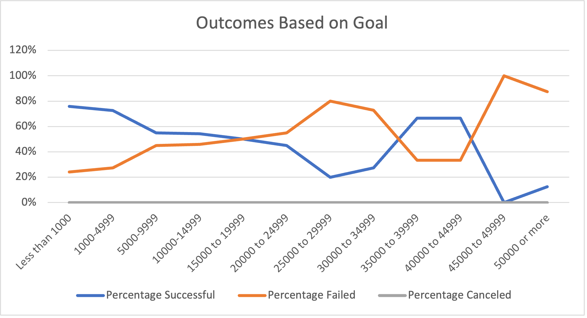

# Kickstarter_Analysis
Viability Analysis of a Kickstarter Campaign

## Overview of Louise’s Kickstarter Evaluation

Louise approached me to analyze the viability of using a Kickstarter campaign to generate funds for a play she would like to produce. I prepared a document with relevant data that will help Louise in her pursuit.

###### _Note: As Louise is based in the United States, I used only data from the according subset._

# Analysis and Challenges

## Outcomes Based on Goals

In the Outcomes Based on Goals chart you’ll notice that the percentage of failed campaigns is inverse to the percentage of successful campaigns. Campaigns with more approachable levels of backer pledges have the highest success rate overall. We also see that despite getting several high-level pledges, they don’t quite make up for the amount of pledges at the lower level.  We see the exact opposite result when it comes to failed campaigns and their pledge levels. The results of this graph can help Louise set her goal expectations, and plan her pledge levels.

## Theater Outcomes Based on Launch Date

This chart illustrates the best months to go live with Kickstarters catered toward plays. A few conclusions can be drawn here. First, the successful campaigns far outpaced the failed campaigns. Next we can tell that there is a very specific time of year when Kickstarters are very successful, late spring. The least likely someone is to back a campaign is around the winter holidays–presumably this is because people focus their spending elsewhere. 

Campaign failures follow a similar pattern but with less dramatic results. The chances of a campaign being canceled is minimal, with fewer than 10 cancellations for any month of the year. 

Using the information from the graphs Louise will be more able to determine which direction she should go.

## Challenges	

I encountered quite a few challenges while working on Louise’s project, mainly the steep learning curve of Excel. I made copious amounts of errors but I slowly worked each out as if it was a puzzle. I freed myself of time constraints so I could watch the lesson over again, as slowly as I needed to. I made liberal use of AskBCS, a very helpful tool.

# Results

Using the Theater Outcomes by Launch Date graph I conclude that one, the best time of year for a play Kickstarter to begin is late spring into early summer--It's also a very, very bad idea to start this type of campaign in December. The risk of canceled plays is low, fewer than 10 per month are canceled.

When it comes to Outcomes Based on Goals, I assessed that the number one contributor to successful campaigns is a lower pledge. There is an uptick of pledges in the $35,000 top $45,000 pledge range, but despite this, it's not quite enough to exceed the collective strength of the smaller pledges.

**There are some limitations in this dataset.** One of these being that there isn’t a lot of data as to when campaigns go live. It could be useful to include a chart showing the correlation between the pledge deadline and how long it took the campaign to actually go live as this would help Louise narrow down the time to begin the campaign even further.

I would also like to see a comparison of the location as it relates to the highest number of backers so Louise gets a clear picture of who her backers will be so she can cater her campaign to them.

As such, I suggest the inclusion of charts determining the time between pledges being collected and time taken to go live, and anothjer comparing location of pledges to the highest percentage of the goal.
